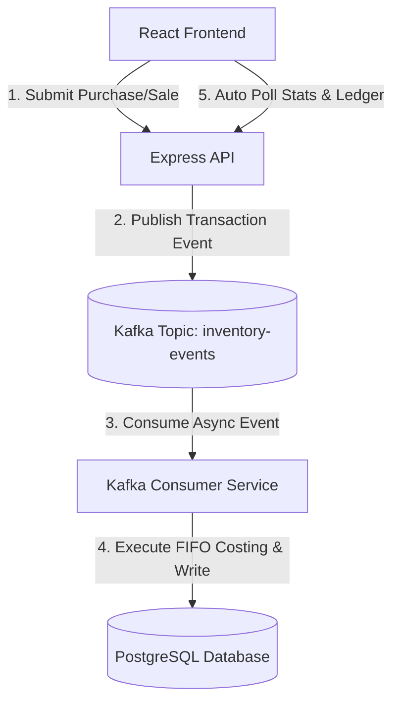

# Real-Time FIFO Inventory Management System

This repository contains the complete implementation of a real-time Inventory Management System using PostgreSQL, Apache Kafka, and React. The project demonstrates the **First-In-First-Out (FIFO) costing method** applied to incoming transaction events.

## Directory Structure

*   [backend/](file:///E:/Project/inventory-management/backend) - Node.js / Express backend service handling API requests, database queries, and Kafka event consumption.
*   [frontend/](file:///E:/Project/inventory-management/frontend) - React/Vite dashboard client application illustrating stock valuations, ledger entries, and transaction inputs.

---

## Architecture Overview



1.  **Ingestion Phase**: When a purchase or sale transaction is submitted via the frontend (or simulator), it goes to the REST API, which publishes it immediately to the `inventory-events` Kafka topic.
2.  **Processing Phase**: The consumer service listens to the topic, picks up the event, opens a PostgreSQL transaction, executes the FIFO cost calculation logic, updates active inventory batches, and logs the records to the transactions ledger.
3.  **Visualization Phase**: The React frontend polls dashboard endpoints every 3 seconds to fetch aggregate metrics, product stock states, and ledger records, reflecting updates in real-time.

---

## Quickstart Guide

To run the entire stack locally:

### 1. Database Setup
Create a database called `inventory_management` in PostgreSQL and run the DDL schema script:
```bash
psql -d inventory_management -f backend/src/sql/schema.sql
```

### 2. Run Infrastructure (Kafka / Redpanda)
Ensure Redpanda or Kafka is running. A default Redpanda server can be started using the docker-compose file:
```bash
cd backend
docker-compose up -d
```

### 3. Start Backend
In a new terminal:
```bash
cd backend
pnpm install
# configure backend/src/sql/schema.sql first
pnpm dev
```

### 4. Start Frontend
In a new terminal:
```bash
cd frontend
pnpm install
pnpm dev
```

---

## Project Specifications Compliance

*   **FIFO Calculations**: Tracks and consumes remaining batch balances sequentially, calculating accurate costs of goods sold.
*   **Ledger Reports**: Contains separate filters for purchases (buys) and sales (FIFO evaluated).
*   **Interactive Accordion**: Groups stock items at the product level, with accordion toggles exposing granular batch details.
*   **Secure Access**: Implements authentication headers, remember-me options, and hidden inner-field eye icon toggles.
